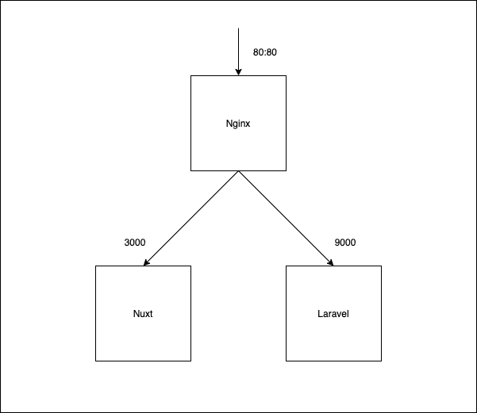

## 概要
Nuxt + Laravel(Lumen)の開発環境構築テンプレートです。

### 関係図


## 開発環境立ち上げ
```
$ docker-compose up
```

## Frontend
下記のコマンドでNuxtプロジェクトを作成します。
./frontendというディレクトリにNuxtプロジェクトが一式準備されます。

### 1. プロジェクトの作成
```
$ docker-compose exec frontend yarn create nuxt-app ./
```

### 2. 監視
下記コマンドで常時ビルドするようにします。
```
$ docker-compose exec frontend yarn dev
```

## Backend
下記のコマンドでLumenプロジェクトを作成します。
※ Laravelもほぼ同じなので省略します。

### 1. 仮プロジェクトの作成
※ 直下はファイルが存在しているため不可能
```
$ docker-compose exec api composer create-project --prefer-dist laravel/laravel blog
```

### 2. 作成した仮プロジェクトを直下にコピー
```
$ docker-compose exec api cp -fR ./blog/. ./
```

### 3. 仮プロジェクトを削除
```
$ docker-compose exec api rm -rf ./blog
```
